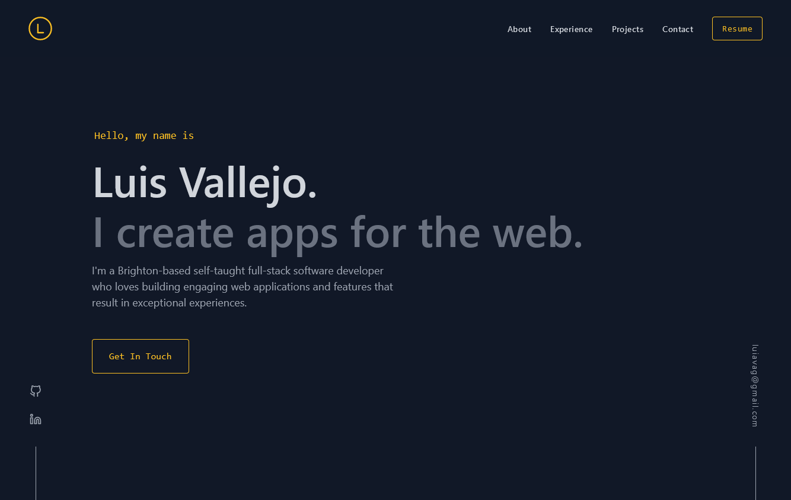

  <a href="https://luvagu.com">
    
    <h1 align="center">luvagu.com</h1>
  </a>

    Luvagu Portfolio built with <a href="https://nextjs.org/" target="_blank">Next.js</a>, <a href="https://tailwindcss.com/" target="_blank">Tailwind CSS</a> and hosted with <a href="https://vercel.com" target="_blank">Vercel</a>

    

## Main Features

- Responsive
- Smooth transitions and scrolling
- Server Side Rendered (SSR)
- Static & Incremental Regeneration
- Tailwind CSS & CSS on JSX
- Light Mode (comming soon)
- Blog (comming soon)

## Learn More

To learn more about Next.js, take a look at the following resources:

-   [Next.js Documentation](https://nextjs.org/docs) - learn about Next.js features and API.
-   [Learn Next.js](https://nextjs.org/learn) - an interactive Next.js tutorial.

## Deploy on Vercel

The easiest way to deploy your Next.js app is to use the [Vercel Platform](https://vercel.com/new?utm_medium=default-template&filter=next.js&utm_source=create-next-app&utm_campaign=create-next-app-readme) from the creators of Next.js.

Check out our [Next.js deployment documentation](https://nextjs.org/docs/deployment) for more details.

## Theme Design Credits

I'd like to thank [Britany Chang](https://brittanychiang.com/) for the amaizing effort on putting in this great design. The original version is built on Gatsby and Styled Components. This version is a complete rewrite on Next.js, Tailwind CSS and CSS on JSX.
